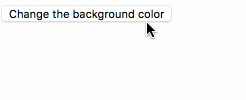
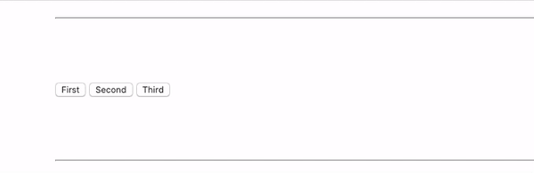
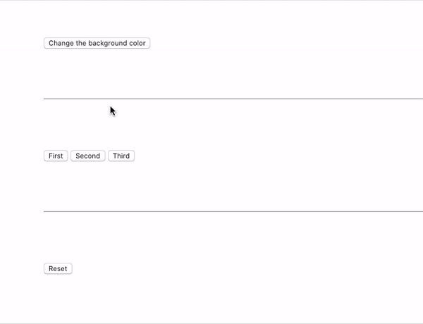
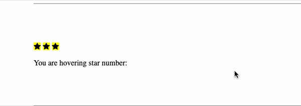
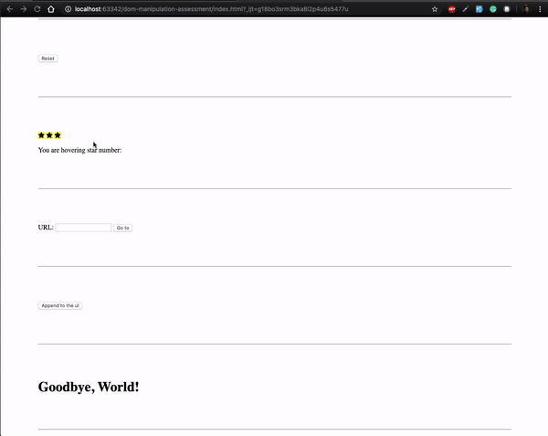
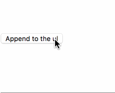
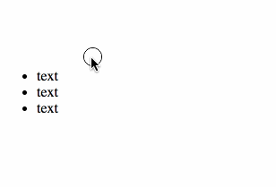
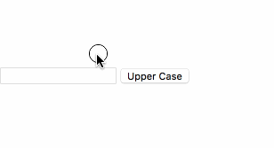
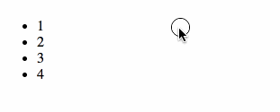
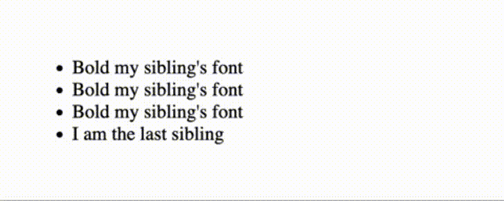

# JavaScript DOM Manipulation Assessment

## Instructions

1. Read all instructions before beginning the assessment

2. Clone this repository

3. Create a branch named `first-last` where `first` is your first name and
   `last` is your last name

4. Write your Javascript code inside of `main.js` to solve the problems below. **NOTE: please use jQuery and BOM methods for this assessment.** Allowing the use of vanilla JS DOM methods is up to the instructor. Please ask your instructor for clarification before the assessment begins.

5. Add and commit throughout the assessment

6. Don't push your branch until the end of the assessment!

After pushing, you should check GitHub and ensure that your branch was
successfully pushed. **If you do not push your branch, you will receive a 0.**

## Problems

**Do NOT modify** the HTML attributes or structure. Use jQuery DOM methods and BOM methods in your solutions.

1. When the button with the id of `change-bg-color` is clicked the background of
   the page should turn blue.

    
    
    [Demo Link](examples/bg-color.gif)

    
2. When a button that belongs to the `btn` class is clicked, change the background color of that button to this color: `#93f2e5`.

    
    
    [Demo Link](examples/problem-2.gif)

    
3. When the button with the id of `reset-btn` is clicked make sure it reloads the page and restores everything back to the initial state.
    
    
        
    [Demo Link](examples/problem-3.gif)

    
4. When a star is being hovered by the mouse: get the selected `data attribute` value from the star being hovered and display it in the element with the id of `review-result`.
    
    
        
    [Demo Link](examples/problem-4.gif)

    
5. When the button with the id of `go-to-btn` is clicked change the window location to the url specified in the URL input with the id of `custom-url`. Consider adding `http://` to your URLS if you want to test external domains.
    
    
        
    [Demo Link](examples/problem-5.gif)

6. When the button with an id of `append-to-ul` is clicked, append an li with
   the content of `text` to the ul with the id of `append-to-me`.
    
    

    [Demo Link](examples/ul-append.gif)

7. Whenever a list item inside of the ul with the id of `font-grow` is _double_
    clicked, the font size of the list item that was clicked should be doubled.
    Example: If the current font-size is 12px double-clicking would turn it into 24, 48...

    

    [Demo Link](examples/font-grow.gif)

8. When the button with the id of `upcase-name` is clicked, the element with the
   id of `output` should display the text `Your uppercase name is: ` + the
   value of the `input` element with the id of `input` transformed to uppercase.

    

    [Demo Link](examples/upcase-name.gif)

9. When a list item inside of the ul with the id of `hl-toggle` is first
   clicked, the background of the li that was clicked should change to
   yellow. When a list item that has a yellow background is clicked, the
   background should toggle back to the original background. Hint: you should use the `yellow-bg` class for this.

   

   [Demo Link](examples/hl-items.gif)

10. When an `li` with the class of `sibling-clicker` is clicked, set the `font-weight` of the `li` below it to `bold`. All other `li`s with the class of `sibling-clicker` should be normal. When the bottom-most `li` with the class of `sibling-clicker` is clicked, set the top-most `sibling-clicker li` to a `font-weight` of `bold`. **Hint**: Notice that the text of the bottom-most `li` is different.

    

    [Demo Link](examples/bold-sibling.gif)

## Grading

Each problem is worth 10 points. Full points will be awarded if your `index.html` file can be opened, and the behavior in the demo gifs is correctly reproduced. Partial credit **may** be awarded at the discretion of the instructor.
